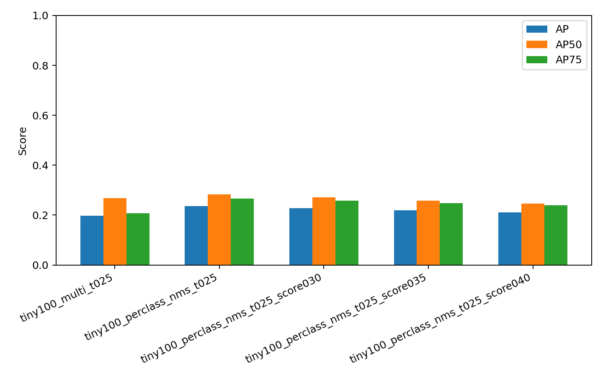
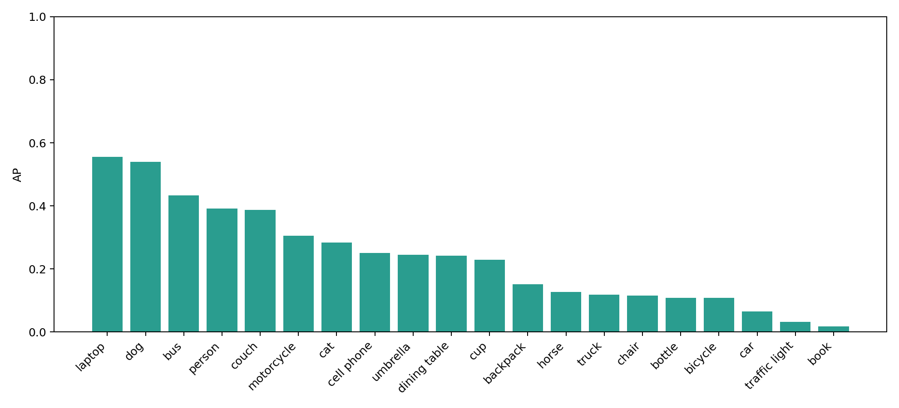
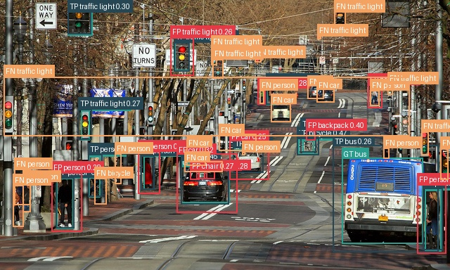
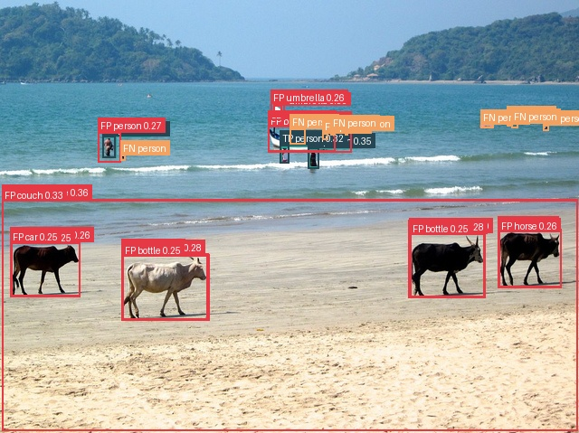

# 基于 Grounding DINO 的开放词汇目标检测复现与评估

Student Name: 待补充姓名1, 待补充姓名2, 待补充姓名3  
Student ID: 待补充学号1, 待补充学号2, 待补充学号3

## 1. Introduction

开放词汇目标检测（Open-Vocabulary Object Detection, OVOD）旨在使检测模型能够根据任意文本描述定位图像中的目标，而不是只能识别训练集中预定义的固定类别。例如，传统目标检测模型通常只能检测 COCO 中的 80 个类别，而开放词汇检测模型可以通过文本提示词（prompt）检测“the person holding an umbrella”“a laptop on the table”等更灵活的语义目标。

本项目选择 Project 4: Open-Vocabulary Object Detection and Visual Grounding，重点复现并评估 Grounding DINO 在开放词汇目标检测任务上的表现。与经典目标检测相比，开放词汇检测的主要挑战包括：

1. 模型需要同时理解图像和自然语言文本；
2. 检测类别不再固定，prompt 的设计会直接影响预测结果；
3. 文本标签与标准数据集类别之间存在映射问题，例如模型可能输出混合短语或不完整标签；
4. 小目标、遮挡目标和密集目标仍然容易漏检或误检。

本项目的主要目标是构建一个完整的开放词汇检测实验流程，包括模型推理、COCO 子集构建、量化评估、阈值分析、prompt 改进以及失败案例分析。我们基于 HuggingFace Transformers 中的 Grounding DINO 实现推理流程，并在 COCO val2017 的 20 类子集上进行定量评估。

## 2. Related Works

开放词汇目标检测通常依赖视觉-语言模型，将图像区域与文本描述对齐。早期的目标检测方法如 Faster R-CNN、YOLO 系列和 DETR 主要针对固定类别进行训练，而开放词汇检测进一步要求模型能泛化到新的文本类别。

CLIP 通过大规模图文对比学习，将图像和文本映射到共享语义空间，为开放词汇识别提供了基础。OWL-ViT 将视觉 Transformer 与文本编码器结合，可以直接使用文本查询进行目标检测。GLIP 将目标检测任务统一为图文 grounding 问题，通过短语与图像区域的对齐提升开放词汇能力。Grounding DINO 进一步结合 DINO 检测器和文本 grounding 机制，在开放词汇检测和 phrase grounding 上取得了较好的效果。

本项目选择 Grounding DINO 作为主要复现对象，原因是其开源实现成熟，HuggingFace 提供了较稳定的模型接口，同时它能够直接接收文本 prompt 并输出检测框、文本标签和置信度，适合作为课程项目中的复现和评估对象。

## 3. Method

### 3.1 整体流程

本项目实现的流程如下：

1. 输入图像和文本 prompt；
2. 使用 Grounding DINO 进行开放词汇检测；
3. 输出检测框、文本标签和置信度；
4. 将预测结果可视化；
5. 将预测结果转换为 COCO detection 格式；
6. 使用 COCOeval 计算 AP、AP50、AP75 和 AR 等指标；
7. 对不同 threshold 和 prompt 策略进行对比分析；
8. 导出 false positive 和 false negative 失败案例。

### 3.2 Grounding DINO 推理

我们没有从头训练模型，而是使用预训练的 Grounding DINO 模型进行 zero-shot 推理。项目中主要使用 HuggingFace 模型接口：

- `IDEA-Research/grounding-dino-tiny`
- `IDEA-Research/grounding-dino-base`

考虑到 100 张图片实验的运行时间，本报告中的主要 100 张定量实验使用 `grounding-dino-tiny`。在小规模 smoke test 中也尝试了 `grounding-dino-base`，但在 20 张图上的结果与 tiny 接近，因此最终报告重点分析更完整的 100 张 tiny 实验。

### 3.3 Prompt 设计

基础 prompt 使用 COCO 20 类类别名，统一转为英文、低写，并用句号分隔，例如：

```text
a person. a bicycle. a car. a motorcycle. a bus. a truck. ...
```

在基础方法中，我们将 20 个类别放在同一个 prompt 中一次性推理。这种方式速度较快，但模型有时会输出混合标签，例如 `traffic light an umbrella`，从而影响类别映射和评估。

为改进这一问题，我们实现了 per-class prompt 策略：每次只查询一个类别，例如：

```text
a person.
a car.
a traffic light.
```

然后将每个类别的检测结果合并。该方法速度明显变慢，但可以避免多类别 prompt 造成的文本标签混乱，并提高 recall。

### 3.4 后处理：NMS

per-class prompt 会产生更多候选框，因此我们进一步加入同类别 NMS（Non-Maximum Suppression）。对于同一类别、同一图像中的预测框，如果 IoU 大于 0.5，则只保留置信度最高的框。最终改进方法为：

```text
per-class prompt + per-label NMS, IoU threshold = 0.5
```

## 4. Experiments

### 4.1 Datasets

本项目使用 COCO val2017 作为评估数据来源。为了控制实验规模并贴合开放词汇检测任务，我们从 COCO val2017 中选取 20 个常见类别：

```text
person, bicycle, car, motorcycle, bus, truck, traffic light, dog, cat, horse,
chair, couch, dining table, bottle, cup, laptop, book, backpack, umbrella, cell phone
```

我们构建了两个子集：

1. 20 张图片 smoke test 子集，用于快速验证流程；
2. 100 张图片正式实验子集，用于主要定量分析。

100 张子集包含：

- 图片数：100
- 类别数：20
- 标注框数：660

数据准备脚本会保留 COCO annotation 格式，方便后续使用 COCOeval 进行标准目标检测评估。

### 4.2 Implementation Details

项目使用 Python 实现，主要依赖如下：

- PyTorch
- HuggingFace Transformers
- Pillow
- pycocotools
- matplotlib
- tqdm

主要脚本包括：

- `scripts/infer.py`：执行 Grounding DINO 推理并生成可视化图和 JSON 结果；
- `scripts/prepare_coco_subset.py`：构建 COCO 子集；
- `scripts/eval_coco.py`：将预测结果转为 COCO detection 格式并计算指标；
- `scripts/export_failure_cases.py`：导出 false positive 和 false negative 失败案例图。

主要实验配置如下：

| 配置项 | 设置 |
|---|---|
| 模型 | IDEA-Research/grounding-dino-tiny |
| 图像数量 | 100 |
| 类别数量 | 20 |
| box threshold | 0.25 |
| text threshold | 0.25 |
| NMS IoU threshold | 0.5 |
| 评估工具 | COCOeval |

### 4.3 Metrics

本项目采用 COCO 目标检测标准指标：

- AP：IoU 从 0.50 到 0.95，步长 0.05 的平均精度；
- AP50：IoU = 0.50 时的平均精度；
- AP75：IoU = 0.75 时的平均精度；
- AP_small / AP_medium / AP_large：不同目标尺寸下的 AP；
- AR100：每张图最多保留 100 个检测框时的平均召回率。

其中 AP 是最主要的综合指标，AP50 更能反映较宽松定位条件下的检测能力，AR100 反映模型是否能够尽可能召回真实目标。

### 4.4 Experimental Design & Results

#### 4.4.1 Threshold 调整

最初使用默认 threshold：

```text
box threshold = 0.40
text threshold = 0.30
```

在 20 张 smoke test 上，AP 仅为 0.0586，AR100 仅为 0.0702，说明模型漏检严重。将 threshold 降至 0.25 / 0.25 后，AP 提升到 0.2866，AP50 提升到 0.3801，说明较低阈值能显著增加召回。

但继续降低到 0.20 / 0.20 后，候选框数量进一步增加，误检增多，AP 下降到 0.2453。因此后续实验采用：

```text
box threshold = 0.25
text threshold = 0.25
```

#### 4.4.2 Multi-class Prompt 与 Per-class Prompt 对比

100 张 COCO 子集上的主要结果如下：

| 方法 | AP | AP50 | AP75 | AR100 | 有效预测数 | 未匹配预测数 |
|---|---:|---:|---:|---:|---:|---:|
| multi-class prompt | 0.1970 | 0.2681 | 0.2081 | 0.3142 | 816 | 118 |
| per-class prompt + NMS | 0.2355 | 0.2832 | 0.2669 | 0.5229 | 2711 | 0 |
| per-class + NMS + score cutoff 0.30 | 0.2272 | 0.2705 | 0.2572 | 0.4741 | 1878 | 0 |
| per-class + NMS + score cutoff 0.35 | 0.2194 | 0.2578 | 0.2484 | 0.4309 | 1334 | 0 |
| per-class + NMS + score cutoff 0.40 | 0.2116 | 0.2464 | 0.2398 | 0.3766 | 918 | 0 |

从结果可以看出，per-class prompt + NMS 是当前最好的方法。相比 multi-class prompt，它将 AP 从 0.1970 提升到 0.2355，将 AP75 从 0.2081 提升到 0.2669，将 AR100 从 0.3142 提升到 0.5229。同时，未匹配预测数从 118 降至 0，说明单类别 prompt 有效减少了文本标签混乱问题。

但是该方法也存在代价：有效预测数从 816 增加到 2711，说明候选框数量显著增加，precision 仍有提升空间；同时每张图需要对 20 个类别分别推理，速度大约比 multi-class prompt 慢 20 倍。



#### 4.4.3 每类 AP 分析

在 multi-class prompt 方法中，表现较好的类别包括 laptop、person、motorcycle、couch、bus 等。per-class prompt + NMS 后，部分类别明显改善：

| 类别 | baseline AP | 改进后 AP | 变化 |
|---|---:|---:|---:|
| dog | 0.022 | 0.540 | +0.517 |
| bus | 0.284 | 0.434 | +0.150 |
| cell phone | 0.125 | 0.251 | +0.125 |
| truck | 0.003 | 0.119 | +0.115 |
| cat | 0.168 | 0.283 | +0.115 |
| couch | 0.292 | 0.388 | +0.095 |

也有部分类别下降，例如 laptop、motorcycle、car、horse、book 和 chair。这说明 per-class prompt 并不是对所有类别都稳定提升，它主要改善了因多类别 prompt 混乱导致的漏检问题，但也可能引入更多低质量候选框。



#### 4.4.4 失败案例分析

我们额外实现了失败案例导出脚本，对预测结果进行 IoU 匹配，并可视化 false positive 和 false negative。图中：

- 绿色框表示 ground truth；
- 蓝色框表示 true positive；
- 红色框表示 false positive；
- 橙色框表示 false negative。

典型失败现象包括：

1. 小目标漏检：traffic light、book、bottle 等小目标容易被忽略；
2. 密集目标误检：多人、多物体场景中容易产生重复框；
3. 相似类别混淆：chair 与 couch、bus 与 truck 等类别存在混淆；
4. per-class prompt 提高 recall 后，false positive 数量也增加。

示例失败案例可视化如下：





#### 4.4.5 自采图片 Demo

本项目还预留了自采图片 demo 流程。用户可以将校园、教室或实验室图片放入：

```text
data/custom_demo/images/
```

然后使用如下 prompt 进行开放词汇检测：

```text
person, chair, laptop, bottle, backpack, book, cell phone, cup
```

目前仓库中尚未包含真实自采图片，因此本报告暂不展示自采图定量结果。后续补充真实场景图片后，可以作为 presentation 中的 qualitative demo。

## 5. Conclusion

本项目复现了基于 Grounding DINO 的开放词汇目标检测流程，并在 COCO val2017 子集上完成了定量评估和结果分析。实验表明，threshold 对开放词汇检测性能影响明显，过高阈值会导致严重漏检；将 box threshold 和 text threshold 设为 0.25 后，召回率显著提升。

进一步地，我们提出并实现了 per-class prompt + NMS 的改进方法。该方法通过逐类别查询减少了文本标签混乱问题，在 100 张 COCO 子集上将 AP 从 0.1970 提升到 0.2355，将 AR100 从 0.3142 提升到 0.5229，并将未匹配预测数从 118 降至 0。该结果说明 prompt 设计和后处理策略对开放词汇检测模型具有重要影响。

不过，该方法也存在明显局限：逐类别推理会显著降低速度，并产生更多候选框，导致 false positive 增加。未来可以继续探索更好的 prompt 模板、类别自适应阈值、跨类别 NMS、以及更强的开放词汇检测模型（如 Grounding DINO base、YOLO-World 或 GLIP）来进一步提升性能。

## Reference

[1] S. Liu, Z. Zeng, T. Ren, F. Li, H. Zhang, J. Yang, et al. Grounding DINO: Marrying DINO with Grounded Pre-Training for Open-Set Object Detection. arXiv:2303.05499, 2023.

[2] A. Radford, J. W. Kim, C. Hallacy, A. Ramesh, G. Goh, S. Agarwal, et al. Learning Transferable Visual Models From Natural Language Supervision. ICML, 2021.

[3] M. Minderer, A. Gritsenko, A. Stone, M. Neumann, D. Weissenborn, A. Dosovitskiy, et al. Simple Open-Vocabulary Object Detection with Vision Transformers. ECCV, 2022.

[4] L. H. Li, P. Zhang, H. Zhang, J. Yang, C. Li, Y. Zhong, et al. Grounded Language-Image Pre-training. CVPR, 2022.

[5] T.-Y. Lin, M. Maire, S. Belongie, J. Hays, P. Perona, D. Ramanan, P. Dollár, and C. L. Zitnick. Microsoft COCO: Common Objects in Context. ECCV, 2014.

[6] HuggingFace Transformers Documentation. Grounding DINO model documentation. https://huggingface.co/docs/transformers/model_doc/grounding-dino

## Contributions

Name1 (SID1, 35%): 待补充。建议填写：模型推理与 Grounding DINO 复现、单图/批量推理脚本实现。

Name2 (SID2, 35%): 待补充。建议填写：COCO 子集构建、COCOeval 评估脚本、量化指标统计。

Name3 (SID3, 30%): 待补充。建议填写：prompt 改进、NMS 后处理、失败案例分析、报告与展示材料整理。
